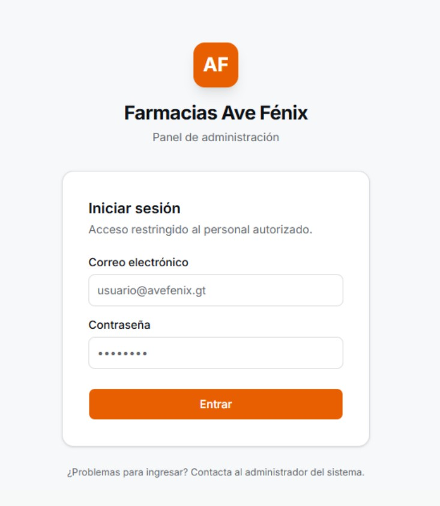
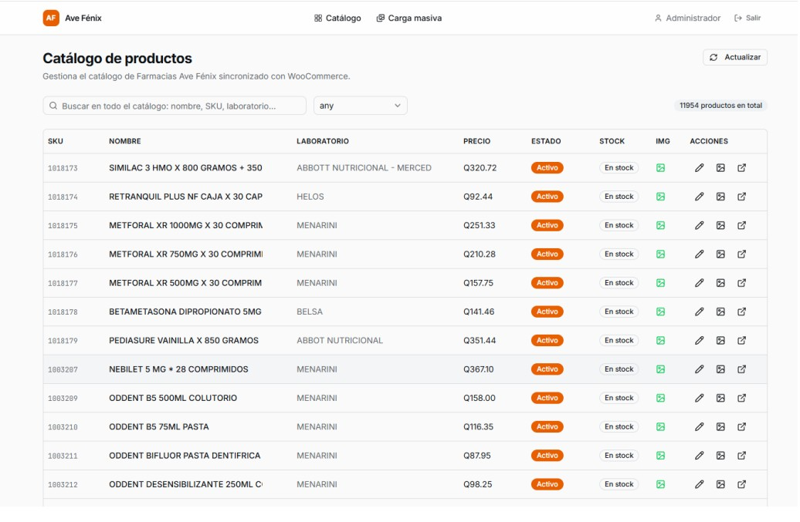
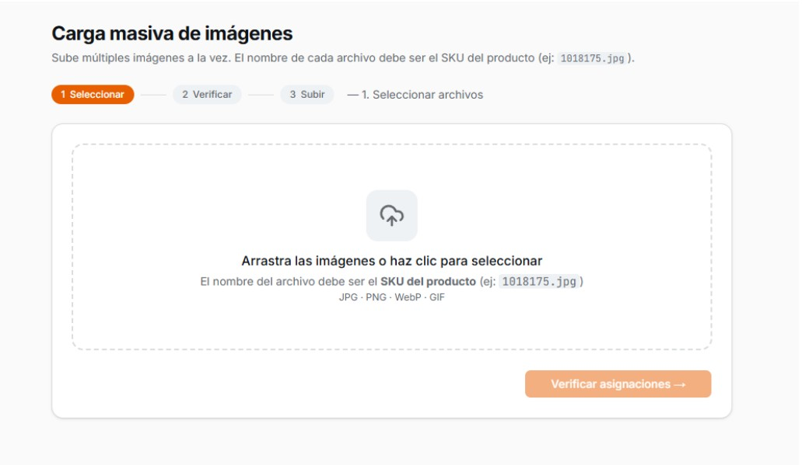
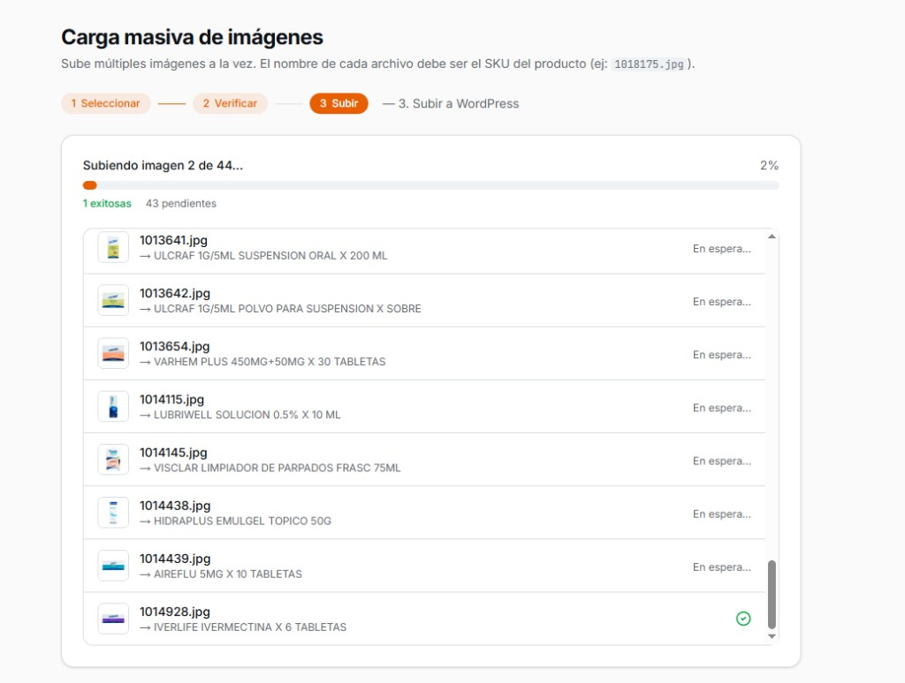
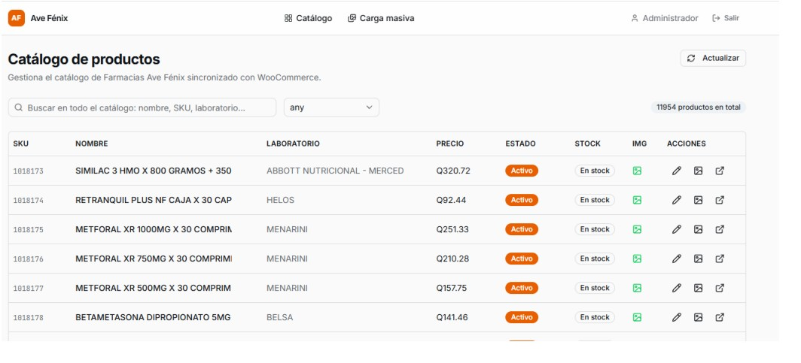

# GUIA PARA SUBIR IMAGENES A LA PAGINA WEB DE AVE FENIX

---

### 1. Ingreso al Sistema
Ingresar al link [https://backoffice.farmaciasavefenix.gt/](https://backoffice.farmaciasavefenix.gt/) y utilizar el usuario:
**Usuario:** admin@avefenix.gt 
**Password:** AveFenix2025! 

*NOTA: Acceso restringido al personal autorizado.*

---

### 2. Panel Principal
Luego de ingresar presenta la siguiente pantalla: 

Para subir varias imágenes de productos se le da clic en **Carga masiva** (los nombres de las imágenes deben de ser el código SKU del producto). 

---

### 3. Carga Masiva de Imágenes
Al darle clik en carga masiva presenta la siguiente página:

**Instrucciones de archivo:**
* Sube múltiples imágenes a la vez.
* El nombre de cada archivo debe ser el SKU del producto (ej: 1818175.jpg).
* Formatos: JPG, PNG, WebP, GIF.

**Proceso:**
1. **Seleccionar:** Se seleccionan o se arrastran las imágenes que se van a subir.
2. **Verificar:** Se le da en el botón de **verificar asignaciones**.

---

### 4. Verificación
Cuando ya estén verificadas las imágenes se mostrarán que imágenes coinciden con un código de producto y cuáles no.

---

### 5. Proceso de Subida
Luego se le da clic en el botón de **subir** y empezará a realizar el proceso de subir las fotos a cada producto.

> **Nota importante:** Debido a un Bugs que tiene no indica que se subieron todas las imágenes, pero si lo realizo solo es de verificar que se subieran correctamente en la página.

---

### Catálogo de productos (Edición Individual)
En la opción de catálogo de productos se tiene la siguiente pantalla:

* En la cual se puede editar el producto y las imágenes producto por producto.
* La última opción sirve para ir a ver la pagina del producto.
---

## Notas Importantes (Solución de Problemas)
* **Error de visualización (Bug):** Existe un problema conocido donde la barra de progreso puede no indicar que se completó el 100%. 
* **Confirmación:** Si la subida parece detenerse, no intente subir de nuevo inmediatamente. Verifique primero en el catálogo si las imágenes ya aparecen actualizadas; usualmente el proceso se completa aunque el mensaje no aparezca.