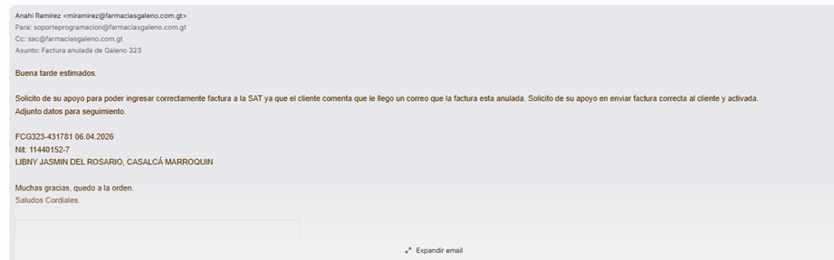
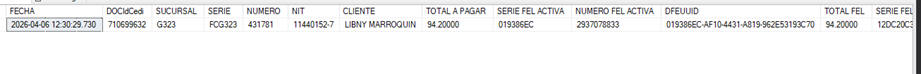
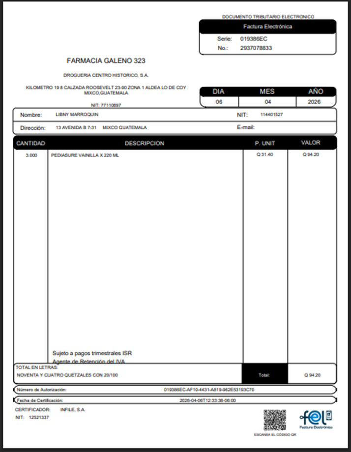
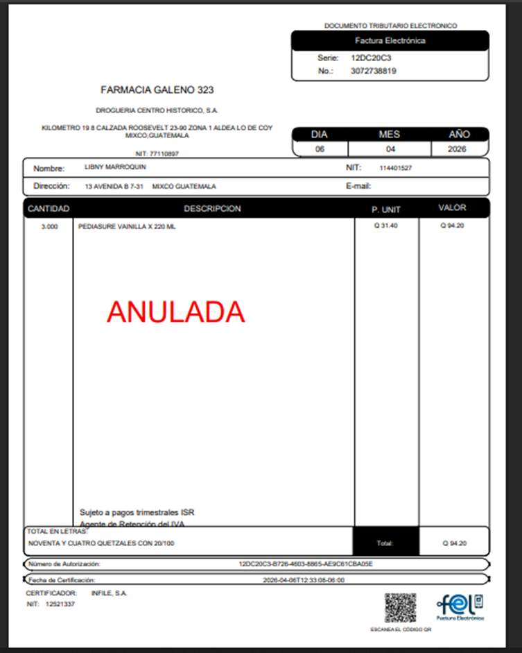
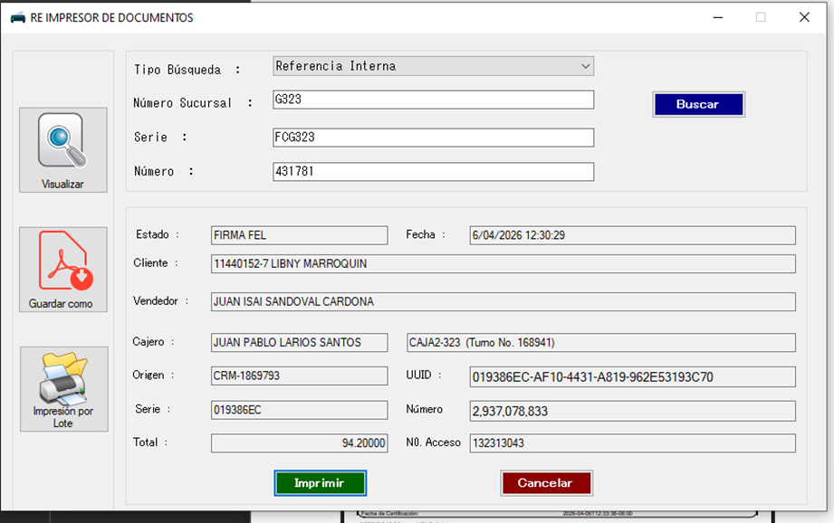

# Manual de Procedimiento: Resolución de Facturas Anuladas (Casos SAC)

---

### 1. ecepción de Incidencia

El proceso inicia cuando el departamento de Servicio al Cliente (SAC) notifica que un cliente recibió una alerta de factura anulada



---

### 2. Consulta Técnica de Firmas FEL
Para identificar qué firma está activa y cuál fue reemplazada por error, se debe ejecutar la siguiente consulta SQL en la base de datos:

```sql
SELECT
    DOCFecha AS [FECHA]
    ,DOCIdCedi
    ,DOCCLTIdSucursal AS SUCURSAL
    ,DOCSerie AS SERIE
    ,DOCNumero AS NUMERO
    ,DOCCFNitCompra AS NIT
    ,DOCCFNombreCompra AS CLIENTE
    ,DOCTotalAPagar AS [TOTAL A PAGAR]
    ,DFESerieFEL AS [SERIE FEL ACTIVA]
    ,DFENumeroFEL AS [NUMERO FEL ACTIVA]
    ,DFEUUID
    ,DFETotalAPagar AS [TOTAL FEL]
    ,ISNULL(DFADSerieFEL_Anular,'') AS [SERIE FEL ANULADA]
    ,ISNULL(CAST(DFADNumero_Anular AS VARCHAR), '') AS [NUMERO FEL ANULADA]
    ,DFADUUId_Anular
FROM
    POS_DOCUMENTOS WITH(NOLOCK)
INNER JOIN
    POS_DOCUMENTOS_FEL WITH(NOLOCK)
    ON DFEDOCidCedi = DOCIdCedi
LEFT JOIN
    POS_DOCUMENTOS_FEL_ANULACION_DTE
    ON DFEIdCedi = DFADDFEIdCedi
WHERE
    DOCSerie = 'FCG323' -- Cambiar según el caso
    AND DOCNumero IN (431781) -- Cambiar según el caso
ORDER BY 2 DESC
```

Esto nos da el resultado:


---

### 3. Validación en SAT
Lo único que hay que validar es que DFEUUID este activo y DFADUUId_Anular este anulado. En el siguiente enlace 
**https://report.feel.com.gt/ingfacereport/ingfacereport_documento?uuid= (aquí pegan el DFEUUID o DFADUUID_Anular)**

**Factura Activa**


---

**Factura Inactiva**


---

### Reimpresor
Ya validado los DFEUUID y DFADUUId_Anular con el reimpresor buscamos y guardamos la factura y respondemos el correo

